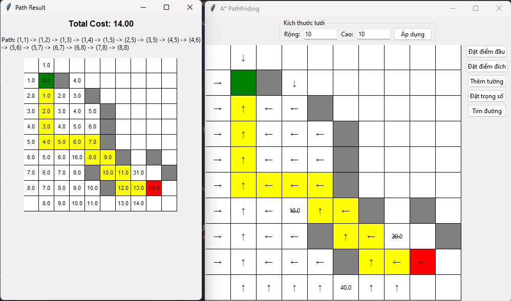
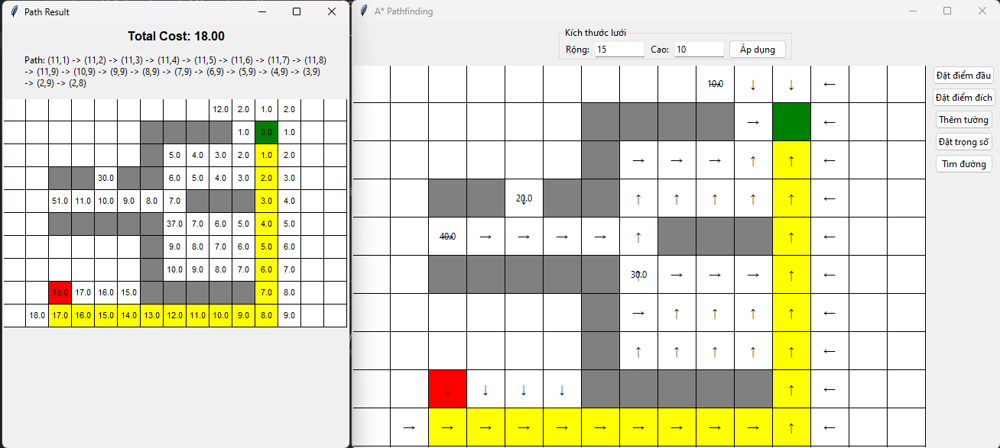

# A* Pathfinding Visualization

This project visualizes the A* pathfinding algorithm using a graphical user interface (GUI) built with Tkinter. The application allows users to set start and goal points, add walls, and assign weights to cells in a grid. The A* algorithm then finds the shortest path from the start to the goal, considering the weights and obstacles.

## Features

- **Set Start and Goal Points**: Click on the grid to set the start and goal points.
- **Add Walls**: Click on the grid to add or remove walls.
- **Set Weights**: Assign weights to cells to simulate different terrains.
- **Visualize Pathfinding**: See the A* algorithm in action as it finds the shortest path.
- **Display Results**: View the total cost and the path found by the algorithm.

## Preview




## Installation

1. Clone the repository:
    ```sh
    git clone https://github.com/phihung0131/Path-Finding-AStart-Algorithm
    cd Path-Finding-AStart-Algorithm
    ```

2. Install the required dependencies:
    ```sh
    pip install -r requirements.txt
    ```

## Usage

1. Run the application:
    ```sh
    python gui.py
    ```

2. Use the control panel to interact with the grid:
    - **Set Start**: Click the "Set Start" button and then click on the grid to set the start point.
    - **Set Goal**: Click the "Set Goal" button and then click on the grid to set the goal point.
    - **Add Wall**: Click the "Add Wall" button and then click on the grid to add or remove walls.
    - **Set Weight**: Click the "Set Weight" button and then click on the grid to assign weights to cells.
    - **Find Path**: Click the "Find Path" button to run the A* algorithm and visualize the path.

## Project Structure

- `gui.py`: Contains the GUI implementation and user interaction logic.
- `data_structures.py`: Defines the data structures used in the project, including the grid and priority queue.
- `pathfinding.py`: Implements the A* pathfinding algorithm and related functions.

